<!-- header: https://andreavitaletti.github.io/assets/slides/bari/bari.html -->

# Il ruolo della cultura digitale per la formazione in design: il punto di vista dell’ingegneria informatica


<script src="https://cdnjs.cloudflare.com/ajax/libs/PapaParse/5.3.1/papaparse.min.js" integrity="sha512-EbdJQSugx0nVWrtyK3JdQQ/03mS3Q1UiAhRtErbwl1YL/+e2hZdlIcSURxxh7WXHTzn83sjlh2rysACoJGfb6g==" crossorigin="anonymous" referrerpolicy="no-referrer">
</script>

<script src="https://cdn.canvasjs.com/canvasjs.min.js"></script>

---
<!-- header: " " -->
<!-- _class: lead -->


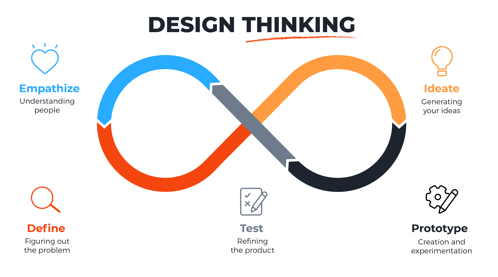

---

<!-- _class: lead -->

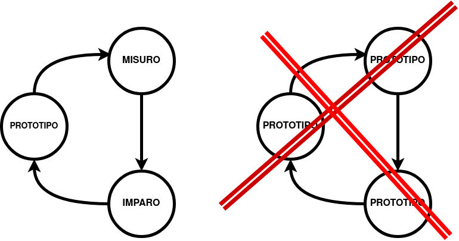

---

<!-- _class: lead -->

# Prototipo

<font size="1">Lo leggete?</font>

<script type="text/javascript">
let si = 0; 
let no = 0; 
</script>


---

<!-- _class: lead -->

# Misuro


## https://forms.gle/gyvduFm9vucMPo1M9

---

# Imparo


```js

let fileUrl = "https://docs.google.com/spreadsheets/d/e/2PACX-1vRyg3VQxZkKPxKs7Ipll5779UF7g-Ovck1Fx_rMX80iEJ7DUbp7S__Uws_3qCnnlO3mecUxCGSS5Jl7/pub?gid=803235601&single=true&output=csv"

Papa.parse(fileUrl, {
        download: true,
        header: true,
        dataType: 'text',
        complete: function(result) {
        	console.log(result.data);
        	console.log(result.data.length);
        	result.data.forEach(function(row) {
    			// now you can loop through each row in here
    			console.log(row["Il carattere del titolo è sufficientemente grande?"]);
    			if (row["Il carattere del titolo è sufficientemente grande?"] === "Si") {
    				si = si + 1;
    			} else {
    				no = no + 1;
    			}
		});
  }
})

```

[Google Sheets](https://docs.google.com/spreadsheets/d/1YjXeWqLpyJ0SGXr7KwTeVXrzd6Hdfo4fscFduWviJN0/edit#gid=803235601)

---


<!--
<p id="si"></p>
<p id="no"></p>
<font id ="dyn" size="1">Ora lo leggete?</font>

<div id="chartContainer" style="height: 300px; width: 100%;">

</div>
-->

<div style="text-align: center;">
      <div id="chartContainer" style="width: 500px; margin: 0 auto; background: #000; color: #fff;">This DIV is centered</div>
</div>


<script>


// Not a real link
let fileUrl = "https://docs.google.com/spreadsheets/d/e/2PACX-1vRyg3VQxZkKPxKs7Ipll5779UF7g-Ovck1Fx_rMX80iEJ7DUbp7S__Uws_3qCnnlO3mecUxCGSS5Jl7/pub?gid=803235601&single=true&output=csv"

Papa.parse(fileUrl, {
        download: true,
        header: true,
        dataType: 'text',
        complete: function(result) {
        	console.log(result.data);
        	console.log(result.data.length);
        	result.data.forEach(function(row) {
    			// now you can loop through each row in here
    			console.log(row["Il carattere del titolo è sufficientemente grande?"]);
    			if (row["Il carattere del titolo è sufficientemente grande?"] === "Si") {
    				si = si + 1;
    			} else {
    				no = no + 1;
    			}
		});
        	//document.getElementById("dyn").innerHTML = ("Ora il caratter ha un rapporto "+si/no*25+"...lo leggete?").fontsize(si/no*25);
			localStorage.setItem('sil', si);
			localStorage.setItem('nol', no);
			plot_data(si,no)
  }
})

function plot_data(si,no) {
	var chart = new CanvasJS.Chart("chartContainer", {
	
		data: [              
		{
			// Change type to "doughnut", "line", "splineArea", etc.
			type: "pie",
			dataPoints: [
				{ label: "Si",  y: si  },
				{ label: "No", y: no  }
			]
		}
		]
	});
	chart.render();
}

</script>
    
---

# Prototipo ... 

<!-- _class: lead -->

<font id ="dyn1" size="1">Ora lo leggete?</font>

<script>
sil = localStorage.getItem('sil');
nol = localStorage.getItem('nol');
document.getElementById("dyn1").innerHTML = ("Ora lo leggete?").fontsize(sil/nol*25);
</script>

```js
document.getElementById("dyn").innerHTML = "Ora lo leggete?".fontsize(si/no*25);
```

---
<!-- footer: " " -->

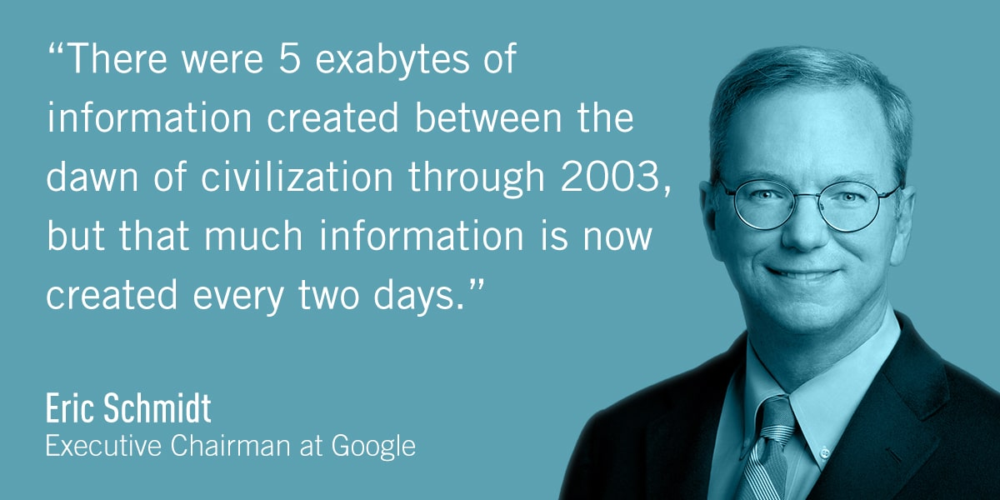

---

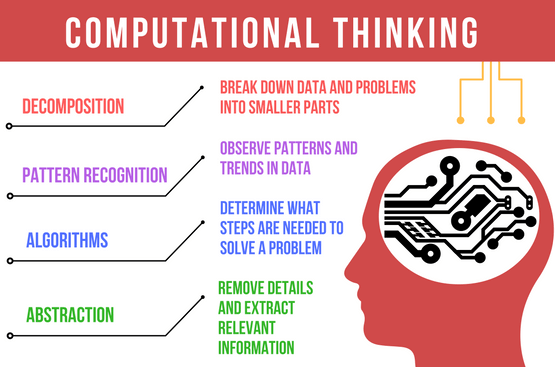

---

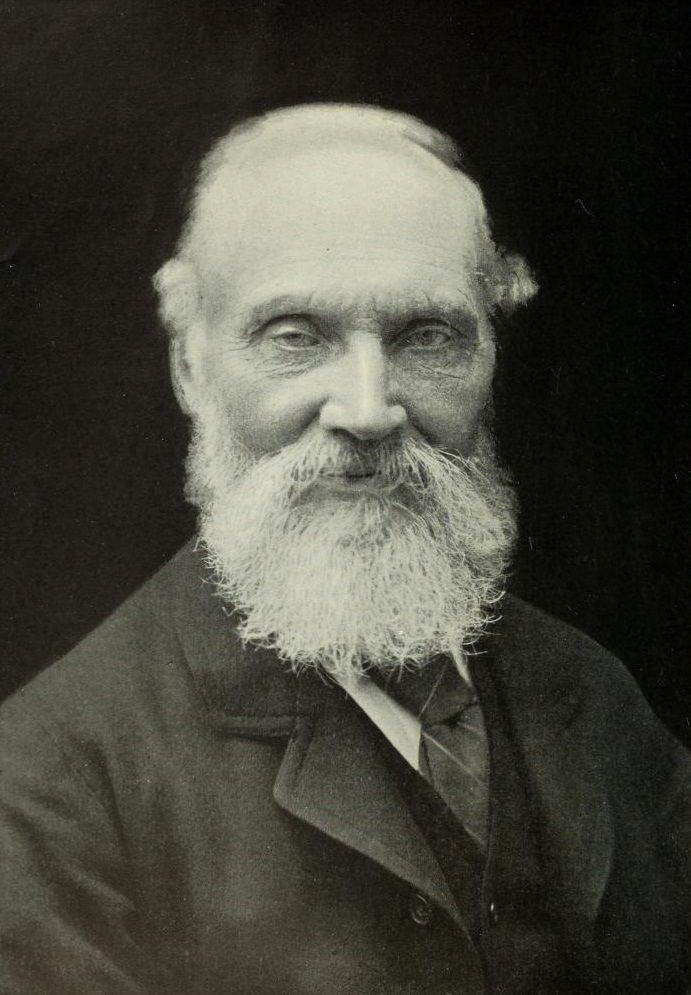

<!-- _class: lead -->

Se non puoi misurarlo, non puoi migliorarlo.

Lord Kelvin

---


---


<!-- _class: lead -->

Gli artisti non hanno bisogno di misurare, i designers dovrebbero averne

---

# Misurare un fenomeno 

* Ingegneri …. “facile”, in molti casi un sensore esiste
* Designers … “difficile”, basato su elementi qualitativi che devono essere trasformati in valutazioni quantitative… design di un  proxy


---

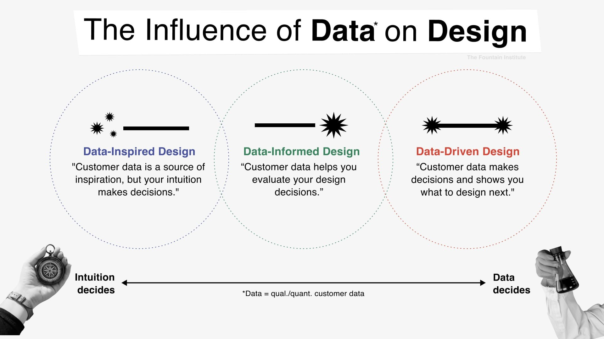

---


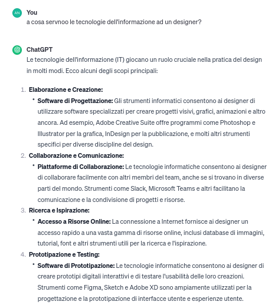

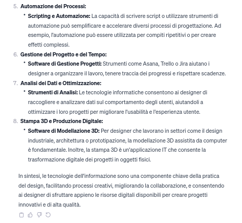

---

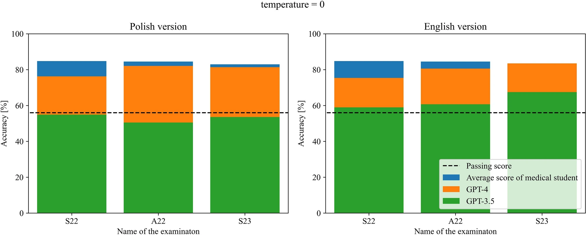

Comparison of the performance of both models along with passing score and average medical graduate score for all three examinations


<font size="1">
Rosoł, M., Gąsior, J.S., Łaba, J. et al. Evaluation of the performance of GPT-3.5 and GPT-4 on the Polish Medical Final Examination. Sci Rep 13, 20512 (2023). https://doi.org/10.1038/s41598-023-46995-z
</font>

---

# Correlazione e Nesso Causale 

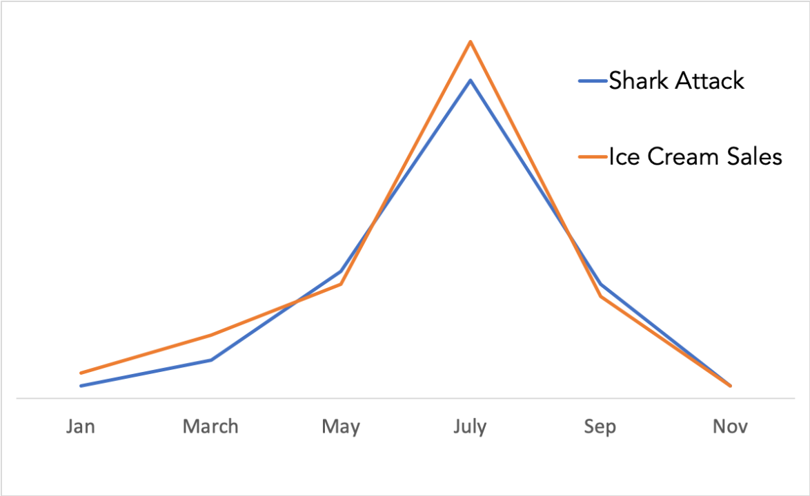

Il nesso causale richiede conferme  sperimentali ... in alcuni casi sono sufficienti gli esperti :-)

---

<!-- footer: 'Andrea Vitaletti Sapienza - vitaletti@diag.uniroma1.it' -->

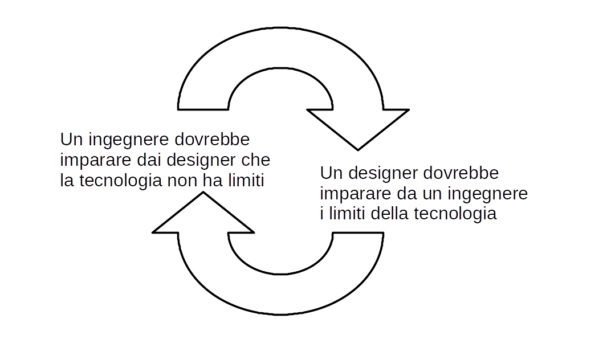
