---
presentation:
  width: 1024
  height: 768
---
<!-- slide -->

# La Fisica della Vela
## A gentle introduction

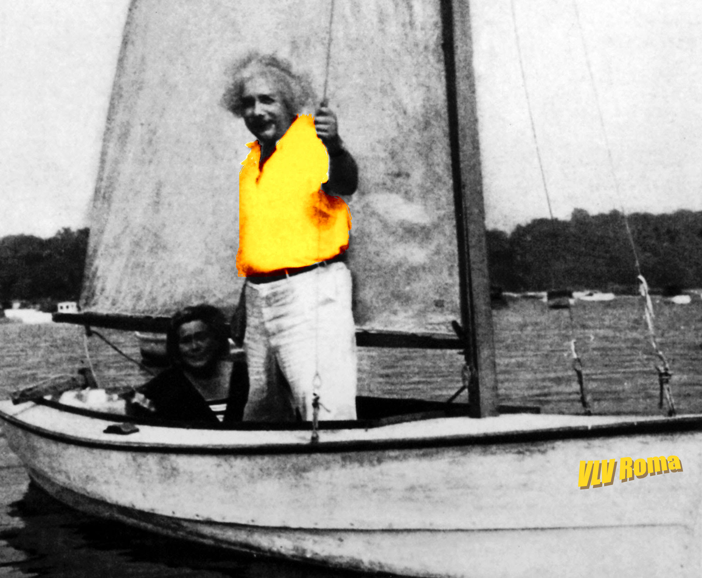

Andrea Vitaletti

<!-- slide -->

# Disclaimer

* I'm an engineer ... sorry for that ;-)
* I'm a modest sailor ... sorry also for that ;-)
* A lot of simplifications
* I tried to credit the work by others on links. If something is missing, first of all I'm really sorry, then please point it out

<!-- slide -->

# Evoluzione 

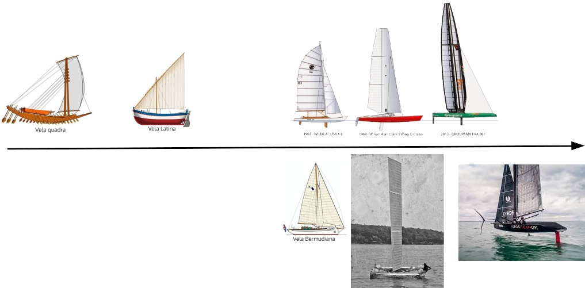

[source](https://www.velavventura.com/storia-della-vela/) and [source](http://sailingtrivia.ravenyachts.fr/2015/06/little-americas-cup-book-four-side.html)

<!-- slide -->

# Le andature

<a href="https://ormeggionline.com/blog/wp-content/uploads/2013/08/ANDAURE.jpg">
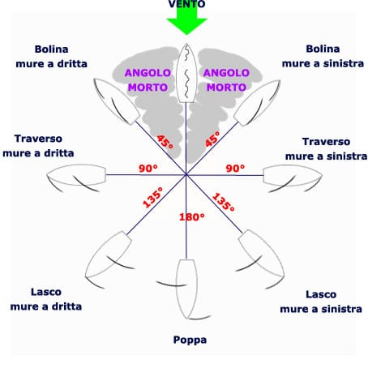
</a>

<!-- slide -->

# Cominciamo da un treno trainato da una fune!

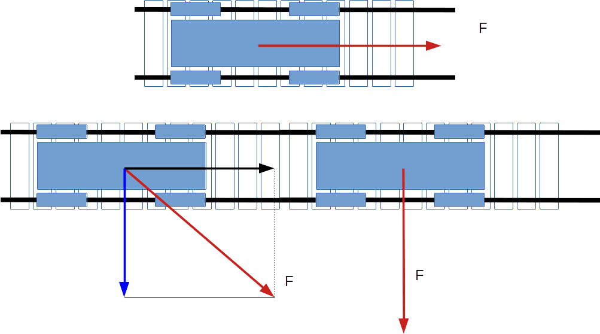

Next slides inspired by [this video](https://www.youtube.com/embed/jJtvGF8vZbE)

<!-- slide -->

# Chi sono i binari?

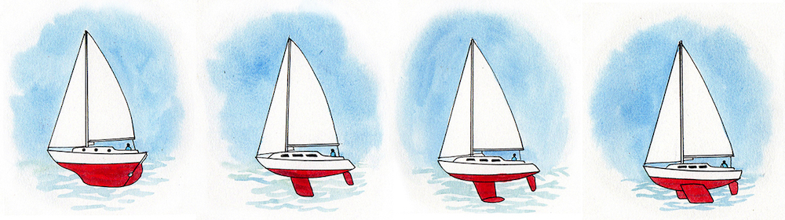

<!-- slide -->

# La Fune?

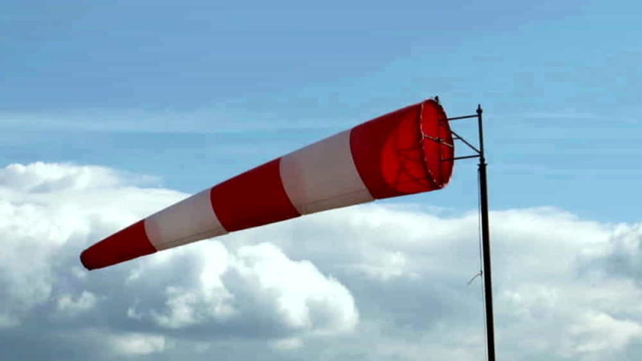

<!-- slide -->

# Vento in poppa

<!-- slide -->

# Al più la velocità del vento

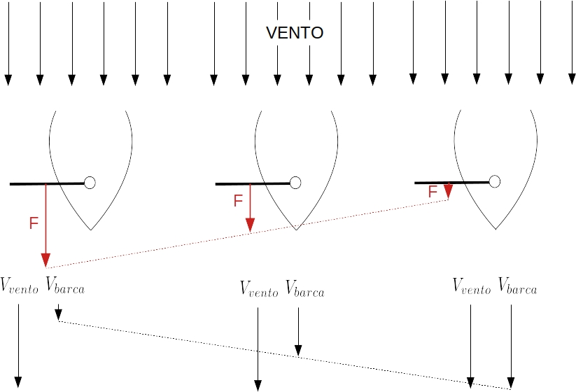

<!-- slide -->

# Al più la velocità del vento

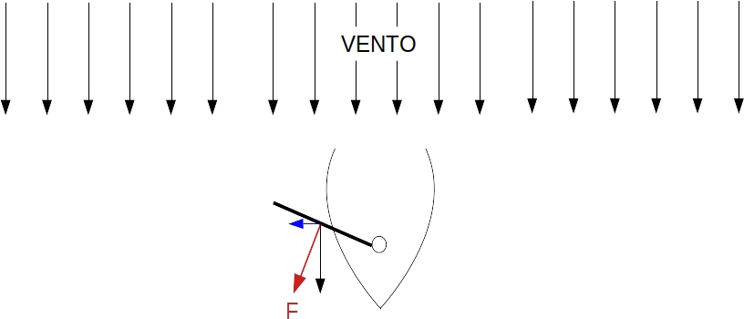

Forza minore: 

* La vela intercetta meno vento
* Forza perpendicolare alla vela non parallela al moto

<!-- slide -->

# Più della velocità del vento

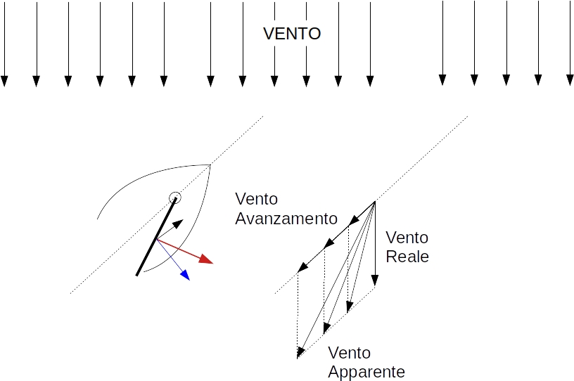

Il vento apparente genera forza propulsiva

<!-- slide -->

# La vela è un'ala

<a href="https://media-cdn.tripadvisor.com/media/photo-s/13/8f/11/aa/il-protagonist-750-della.jpg">
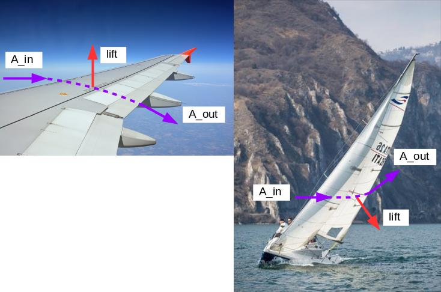
</a>

<!-- slide -->

# Ala esposta ad un flusso d'aria

<iframe width="560" height="315" src="https://www.youtube.com/embed/UqBmdZ-BNig" frameborder="0" allow="accelerometer; autoplay; encrypted-media; gyroscope; picture-in-picture" allowfullscreen></iframe>

<!-- slide -->

# L'ala devia il flusso

<a href="http://utenti.quipo.it/volare/flow-past.gif">
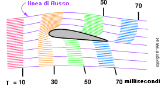
</a>

<!-- slide -->

# [La portanza (lift) per la NASA](https://www.grc.nasa.gov/www/k-12/airplane/lift1.html)

> Lift occurs when a moving flow of gas is turned by a solid object. The flow is turned in one direction, and the lift is generated in the opposite direction, according to Newton's Third Law of action and reaction. Because air is a gas and the molecules are free to move about, any solid surface can deflect a flow. For an aircraft wing, both the upper and lower surfaces contribute to the flow turning. Neglecting the upper surface's part in turning the flow leads to an incorrect theory of lift.

* NIENTE FLUIDO (ARIA), NIENTE PORTANZA
* NIENTE MOVIMENTO, NIENTE PORTANZA

<!-- slide -->

# [Isaac Newton (1642-1726)](https://en.wikipedia.org/wiki/Isaac_Newton)

<!-- slide -->

# Spostare il flusso

La portanza è la **forza** generata dallo spostamento del flusso d'aria

$$ F = ma = m \frac{(V_1-V_0)}{t_1-t_0} $$

<!-- slide -->

# Lo abbiamo sperimentato da piccoli

<!-- slide -->

# Sperimentiamolo da grandi ;-) 

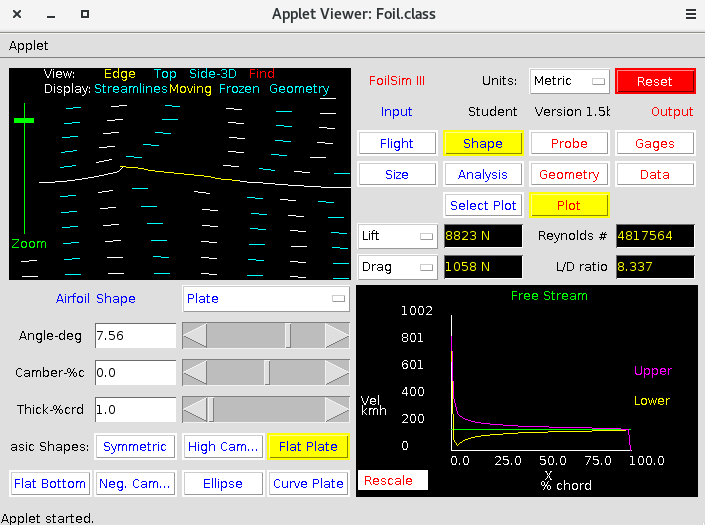  

[FoilSim by NASA](https://www.grc.nasa.gov/www/k-12/airplane/foil3.html)

<!-- slide -->

# [Qualche approssimazione](https://youtu.be/WHHS3wWVf-U)
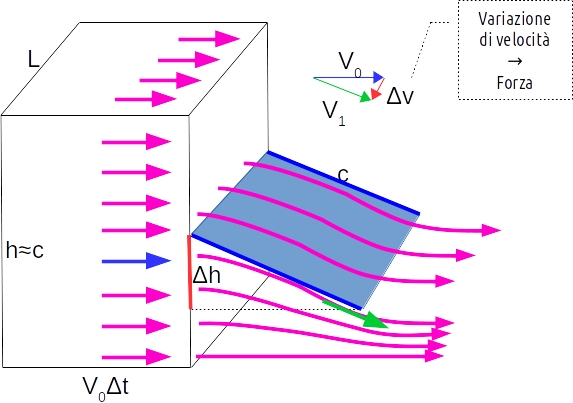  

Nota che: $ \frac{\Delta V}{V} \simeq \frac{\Delta h}{c} $

$m=\rho \text{Vol} = \rho c L v \Delta t = \rho A v \Delta t $

Quindi: $F= m a = m \frac{\Delta V}{\Delta t} \simeq \rho A v \Delta t \frac{\frac{v \Delta h}{c}}{\Delta t} = \rho v^2 A \frac{\Delta h}{c}$

<!-- slide -->

# [Niente male](https://www.grc.nasa.gov/www/k-12/airplane/lifteq.html)

$F=\rho v^2 A \frac{\Delta h}{c}$

* $\rho$ è la densita dell'aria
* $v^2$ è il quadrato della velocità
* $A$ è la superficie dell'ala
* $\frac{\Delta h}{c}$ è l'angolo d'attacco

<!-- slide -->

# Hydrofoil: la vela sotto!!!

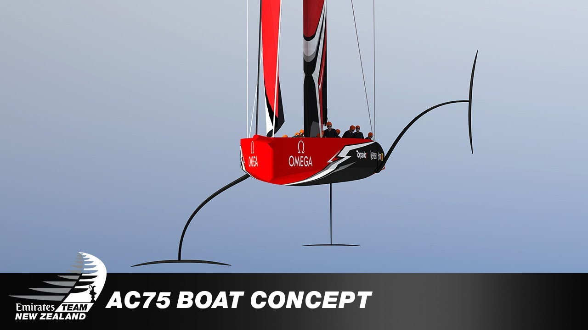

<!-- slide -->

# La densità!

$F=\rho v^2 A \frac{\Delta h}{c}$

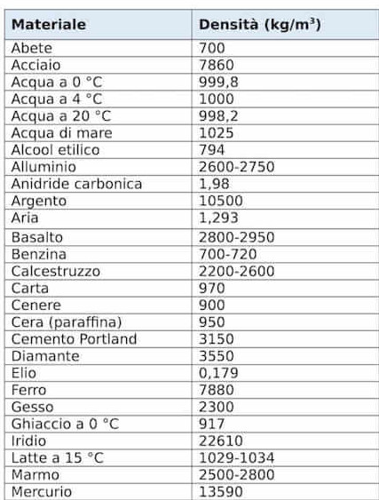

<!-- slide -->

# [Daniel Bernoulli (1700-1782)](https://it.wikipedia.org/wiki/Daniel_Bernoulli)

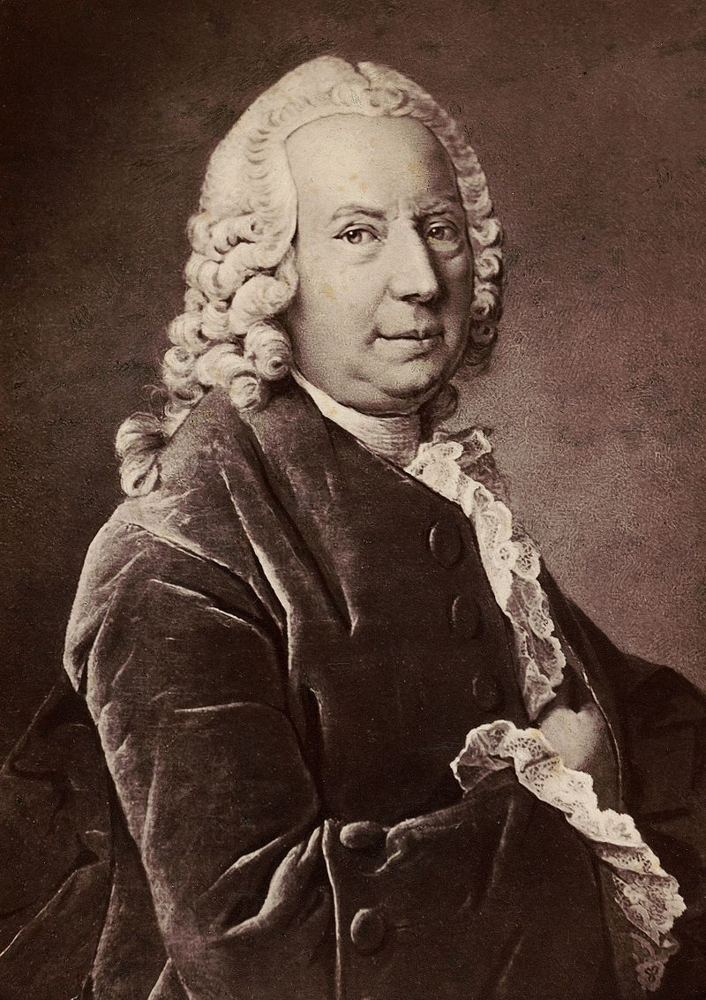

<!-- slide -->

# Pressione statica e dinamica

<a href="https://i.stack.imgur.com/VAuRG.png">
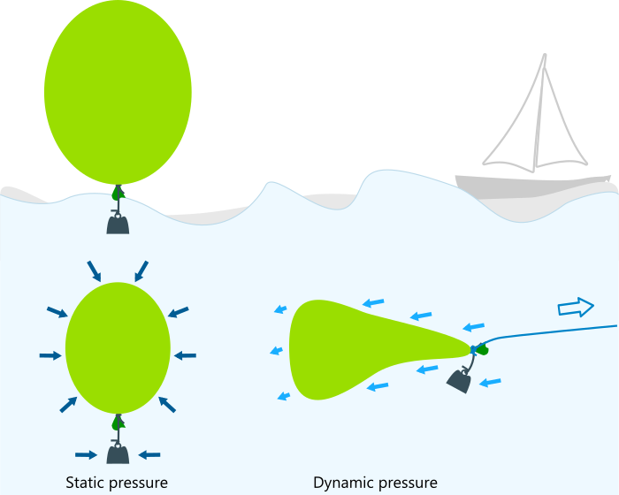
</a>

<!-- slide -->

# [ecco perchè!](http://www.gizio.it/aerodinaelicottero/aerodinamica.htm)

$$ p_t =  p_s + p_d = costante $$

<!-- slide -->

# Probabilmente lo usate spesso!

<!-- slide -->

# Un semplice esempio 

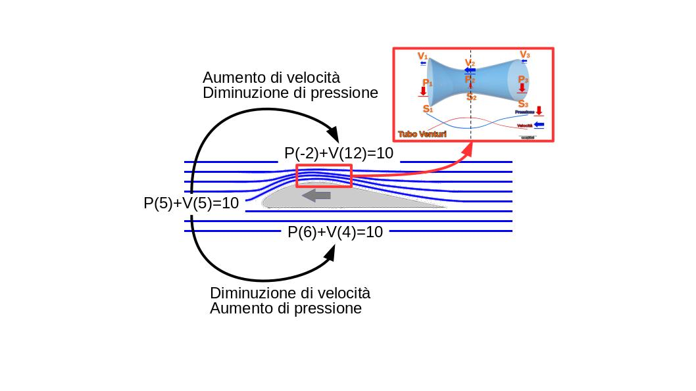

<!-- slide -->

# In sintesi  

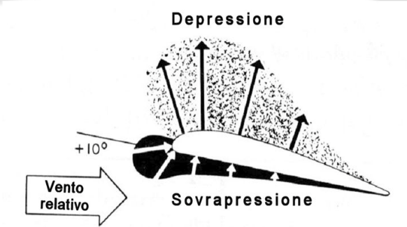 

<!-- slide -->

# Giochiamoci 

 

<!-- slide -->

# Sperimentiamo  

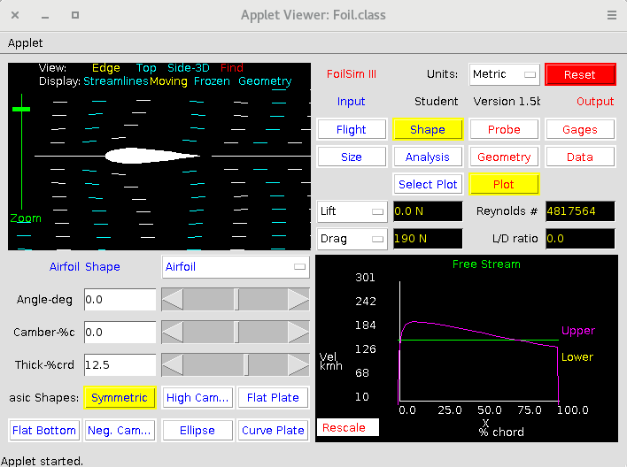  

[FoilSim by NASA](https://www.grc.nasa.gov/www/k-12/airplane/foil3.html)

<!-- slide -->

# Sperimentiamo  

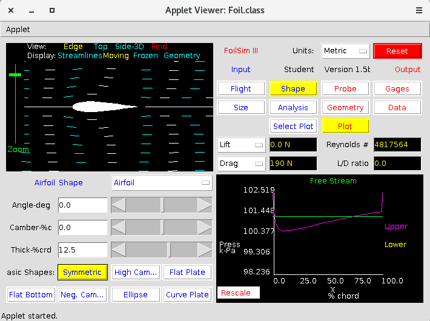  

[FoilSim by NASA](https://www.grc.nasa.gov/www/k-12/airplane/foil3.html)

<!-- slide -->

# Sperimentiamo  

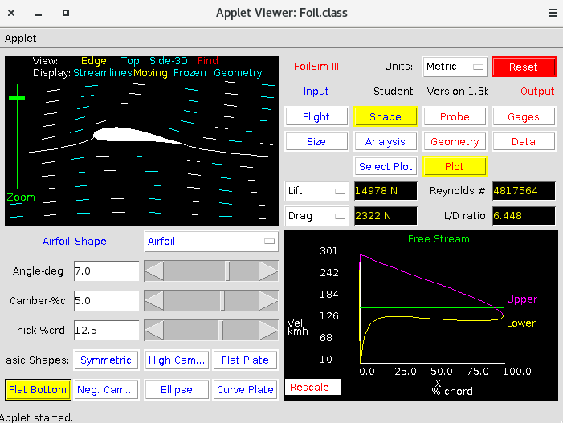  

[FoilSim by NASA](https://www.grc.nasa.gov/www/k-12/airplane/foil3.html)

<!-- slide -->

# Sperimentiamo  

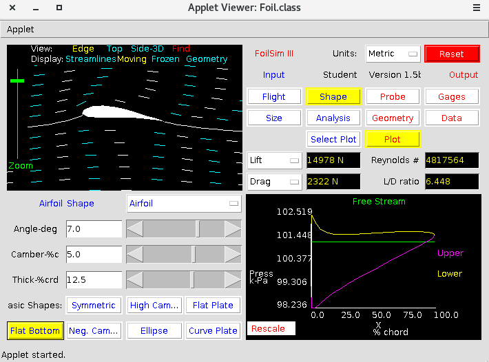  

[FoilSim by NASA](https://www.grc.nasa.gov/www/k-12/airplane/foil3.html)

<!-- slide -->

# [Un errore consolidato](https://www.grc.nasa.gov/www/k-12/airplane/wrong1.html)

<!-- slide -->

# Sveliamo il mistero

<iframe width="560" height="315" src="https://www.youtube.com/embed/UqBmdZ-BNig" frameborder="0" allow="accelerometer; autoplay; encrypted-media; gyroscope; picture-in-picture" allowfullscreen></iframe>

<!-- slide -->

# I due flussi non arrivano insieme!

<!-- slide -->

# La realtà è molto complessa

<iframe width="560" height="315" src="https://www.youtube.com/embed/LrSoNICufBA" frameborder="0" allow="accelerometer; autoplay; encrypted-media; gyroscope; picture-in-picture" allowfullscreen></iframe>

<!-- slide -->

# Basta Bernoulli?

<!-- slide -->

# [Definizione di portanza della NASA](https://www.grc.nasa.gov/www/k-12/airplane/lift1.html)

> **Lift occurs when a moving flow of gas is turned by a solid object.** The flow is turned in one direction, and the lift is generated in the opposite direction, according to Newton's Third Law of action and reaction... any solid surface can deflect a flow. For an aircraft wing, both the upper and lower surfaces contribute to the flow turning. Neglecting the upper surface's part in turning the flow leads to an incorrect theory of lift.

<!-- slide -->
# Portanza e angolo di attacco

<a href="https://www.incoaching.it/wp-content/uploads/2016/10/2.png">
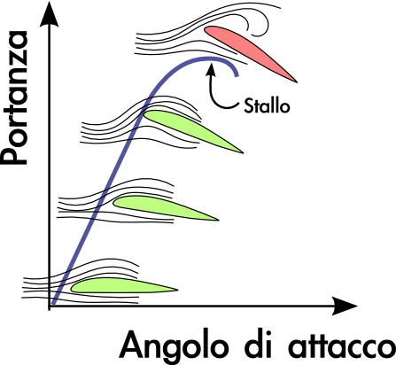
</a>

<!-- slide -->

# Effetto Coanda

<iframe width="560" height="400" src="https://www.youtube.com/embed/w_Q1T0Y0mUU" frameborder="0" allow="accelerometer; autoplay; encrypted-media; gyroscope; picture-in-picture" allowfullscreen></iframe> 

<!-- slide -->

# [Henry Coanda (1886-1972)](https://en.wikipedia.org/wiki/Henri_Coand%C4%83)

<!-- slide -->

# [Effetto Coanda](https://en.wikipedia.org/wiki/Coand%C4%83_effect)

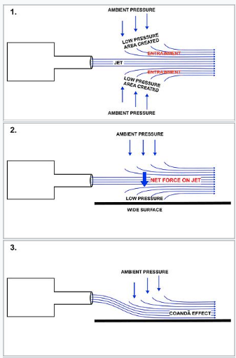
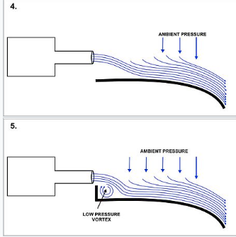

<!-- slide -->

# Effetto Coanda sull'ala

... ecco perchè ha un profilo arrotondato!

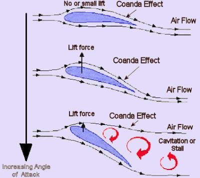 

<!-- slide -->

# A questo punto non resta che costruire un ala 

<iframe width="560" height="315" src="https://www.youtube.com/embed/ufeky6EIXQ4?start=206" frameborder="0" allow="accelerometer; autoplay; encrypted-media; gyroscope; picture-in-picture" allowfullscreen></iframe>